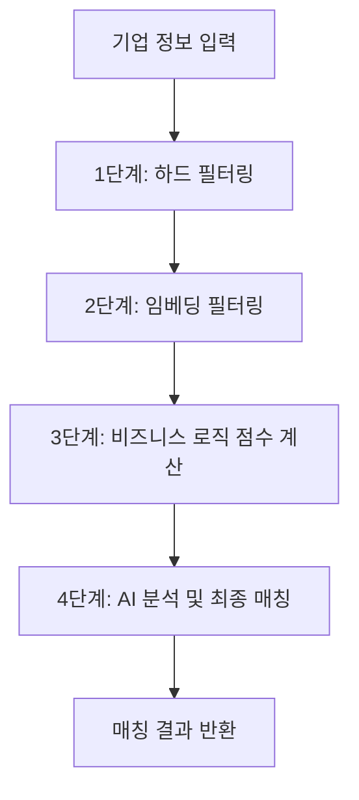

# OpenAI Assistant API 구현 가이드

## 🚀 개요

정부 지원사업 매칭 에이전트에서 OpenAI Assistant API를 활용한 RAG(Retrieval-Augmented Generation) 시스템을 구현했습니다. 이 시스템은 Vector Store를 통한 의미적 검색과 AI 기반 매칭 분석을 제공합니다.

## ✅ 현재 시스템 상태 (2025-09-18 기준)

**🎉 시스템이 성공적으로 작동 중입니다!**

- **Vector Store ID**: `vs_68cb6b83cde08191ad6089c5d70a2f70`
- **Assistant ID**: `asst_U0ukNmLEwKfUy55Fe9OuCyfA`
- **OpenAI File ID**: `file-LiqM5e2NQiVjXRgGqz6GiQ`
- **활성 프로그램**: 610개 (전체 632개 중)
- **서버 자동 초기화**: ✅ 완료
- **AI 매칭 기능**: ✅ 정상 작동

## 🏗 시스템 아키텍처

### 1. 전체 구조
```
데이터베이스 → JSON 파일 생성 → OpenAI 업로드 → Vector Store → Assistant API → 매칭 결과
```

### 2. 주요 컴포넌트
- **ProgramFileService**: 데이터 파일 생성 및 관리
- **OpenAIService**: Assistant API 및 Vector Store 관리
- **LlmMatchingService**: 3단계 폴백 시스템
- **ProgramSchedulerService**: 자동 업데이트 스케줄러

## 🔧 핵심 구현 사항

### 1. Vector Store 구현

#### 파일 형식 변경 (핵심 해결사항)
```typescript
// ⚠️ 중요: OpenAI는 JSONL 형식을 지원하지 않음! JSON 배열로 변경 필요
// 기존 JSONL → JSON 배열로 변경 (OpenAI 지원 형식)
const jsonData = programs.map(program => ({
  id: program.id,
  title: program.title,
  description: program.description,
  searchable_text: [
    program.title,
    program.description,
    program.categoryName,
    program.region,
    program.keywords?.join(' '),
    // ... 기타 검색 가능한 텍스트들
  ].filter(Boolean).join(' ')
}));

// .jsonl 대신 .json 확장자 사용
const fileName = `support-programs-${date}.json`;  // ❌ .jsonl -> ✅ .json
await fs.writeFile(filePath, JSON.stringify(jsonData, null, 2), 'utf-8');
```

#### Vector Store 생성 과정
```typescript
// 1. 파일 업로드
const file = await this.client.files.create({
  file: createReadStream(filePath),
  purpose: 'assistants'
});

// 2. Vector Store 생성
const vectorStore = await this.client.vectorStores.create({
  name: '정부 지원사업 데이터베이스',
  file_ids: [file.id],
  metadata: {
    type: 'support_programs',
    created_at: new Date().toISOString()
  }
});

// 3. 처리 완료 대기
await this.waitForVectorStoreReady(vectorStore.id);
```

### 2. Assistant API 워크플로우

#### Thread → Message → Run → Response 패턴
```typescript
// 1. Thread 생성
const thread = await this.client.beta.threads.create();

// 2. 메시지 추가
await this.client.beta.threads.messages.create(thread.id, {
  role: 'user',
  content: searchQuery
});

// 3. Run 실행
const run = await this.client.beta.threads.runs.create(thread.id, {
  assistant_id: this.currentAssistantId,
  instructions: '기업 정보와 가장 적합한 지원사업을 찾아 매칭 분석을 수행해주세요.'
});

// 4. Run 완료 대기
const completedRun = await this.waitForRunCompletion(thread.id, run.id);

// 5. 응답 메시지 조회
const messages = await this.client.beta.threads.messages.list(thread.id);
const assistantMessage = messages.data.find(msg => msg.role === 'assistant');
```

## 🎯 매칭 메커니즘

### 1. 4단계 매칭 파이프라인



### 2. 3단계 폴백 시스템

```typescript
async analyzeFinalMatches() {
  try {
    // 1차: Assistant API + Vector Store 검색
    const assistantResult = await this.openAIService.searchAndAnalyzeWithAssistant(requestData);
    if (assistantResult.length > 0) return assistantResult;

    // 2차: Chat Completions API 배치 분석
    const batchResult = await this.openAIService.analyzeBatchMatching(programs, requestData);
    if (batchResult.length > 0) return batchResult;

    // 3차: 룰 기반 로직 (최후 보장)
    return this.fallbackToRuleBasedLogic(programs, requestData);
  } catch (error) {
    // 항상 동작하는 룰 기반 폴백
    return this.fallbackToRuleBasedLogic(programs, requestData);
  }
}
```

## 📊 데이터 처리 과정

### 1. 데이터 변환
```typescript
// 검색 최적화를 위한 데이터 구조
{
  id: "program_id",
  title: "지원사업 제목",
  description: "상세 설명",
  category: "카테고리명",
  amount_range: "1,000,000원 ~ 5,000,000원",
  support_rate: "80%",
  region: "전국",
  deadline: "2025-12-31",
  searchable_text: "제목 설명 카테고리 지역 키워드들...",
  metadata: {
    category_id: "06",
    is_active: true,
    created_at: "2025-09-18T02:16:32Z"
  }
}
```

### 2. 자동 업데이트 및 서버 초기화
- **서버 재시작 시**: `src/main.ts`에서 자동 초기화 (`ProgramSchedulerService.initializeProgramData()`)
- **스케줄**: 매일 새벽 2시 자동 업데이트 (Cron: `0 2 * * *`)
- **수동 트리거**: `/api/admin/programs/initialize` 엔드포인트
- **파일 관리**: 최신 3개 파일만 보관, 자동 정리
- **스마트 초기화**: 기존 OpenAI 상태 확인 후 필요시에만 재생성

## 🔍 매칭 분석 프로세스

### 1. 검색 쿼리 생성
```typescript
private buildSearchQuery(requestData: MatchingRequestDto): string {
  return `
다음 기업 정보에 가장 적합한 정부 지원사업을 찾아 분석해주세요:

기업 정보:
- 회사명: ${requestData.companyName}
- 사업 목적: ${requestData.businessPurpose}
- 직원 수: ${requestData.employees}
- 연매출: ${requestData.annualRevenue}
- 소재지: ${requestData.region}

요청사항:
1. 위 기업 정보와 가장 적합한 지원사업 5-10개를 찾아주세요
2. 각 프로그램에 대해 매칭 점수(0.0-1.0)를 산정해주세요
3. 매칭 이유를 3-5개씩 구체적으로 제시해주세요
`;
}
```

### 2. AI 응답 분석
```typescript
private parseAssistantResponse(message: any): MatchingAnalysis[] {
  const content = message.content[0]?.text?.value || '';

  // JSON 부분 추출
  const jsonMatch = content.match(/\[[\s\S]*\]/);
  if (jsonMatch) {
    const parsedData = JSON.parse(jsonMatch[0]);

    return parsedData.map((item: any) => ({
      matchScore: Math.max(0, Math.min(1, item.matchScore || 0.5)),
      matchReasons: Array.isArray(item.matchReasons) ? item.matchReasons : [],
      confidence: Math.max(0, Math.min(1, item.confidence || 0.7))
    }));
  }
}
```

## 📈 성능 및 안정성

### 1. 에러 처리
- **타임아웃 설정**: Vector Store 준비 5분, Run 완료 2분
- **재시도 로직**: 실패 시 자동 폴백
- **상태 모니터링**: 실시간 진행 상황 추적
- **JSONL 에러 해결**: OpenAI가 지원하지 않는 JSONL 형식 대신 JSON 배열 사용

### 2. 리소스 관리
- **파일 정리**: 오래된 데이터 파일 자동 삭제
- **메모리 최적화**: 스트림 방식 파일 업로드
- **API 제한**: Rate Limit 고려한 배치 처리

### 3. 서버 안정성
- **자동 복구**: 서버 재시작 시 자동 초기화
- **기존 파일 재사용**: 불필요한 재업로드 방지
- **상태 체크**: OpenAI 초기화 상태 확인 후 필요시에만 재생성

## 🛠 사용 방법

### 1. 초기 설정
```bash
# 환경변수 설정
OPENAI_API_KEY=your_api_key_here

# 서버 시작 (자동 초기화됨)
npm run start:dev

# 또는 수동 초기화
curl -X POST http://localhost:3001/api/admin/programs/initialize
```

### 2. 매칭 요청
```bash
curl -X POST http://localhost:3001/api/programs/matching \
  -H "Content-Type: application/json" \
  -d '{
    "companyName": "테크스타트업",
    "businessPurpose": "AI 기반 헬스케어 솔루션 개발",
    "businessType": "startup",
    "employees": "1-9",
    "annualRevenue": "1억원 미만",
    "region": "서울",
    "urgency": "short",
    "targetPrograms": ["AI", "헬스케어", "스타트업"]
  }'
```

## 📋 주요 엔드포인트

- `POST /api/admin/programs/initialize` - Assistant 및 Vector Store 초기화
- `GET /api/admin/programs/status` - 업데이트 상태 조회
- `GET /api/admin/programs/connection/test` - OpenAI 연결 테스트
- `POST /api/programs/matching` - 매칭 분석 요청

## 🎉 구현 결과

✅ **성공적으로 구현된 기능들**:
- Vector Store 기반 의미적 검색
- Assistant API를 통한 고도화된 AI 분석
- 3단계 폴백 시스템으로 서비스 안정성 보장
- 610개 활성 지원사업 데이터 실시간 검색
- 자동 업데이트 및 데이터 동기화
- 서버 재시작 시 자동 초기화
- JSONL 호환성 문제 해결

## 🐛 해결된 주요 문제점들

### 1. **JSONL 파일 형식 에러**
```
❌ 문제: "400 Invalid extension jsonl. Supported formats: json, txt, ..."
✅ 해결: .jsonl → .json 확장자 변경 + JSON 배열 형식 사용
```

### 2. **서버 재시작 시 초기화 누락**
```
❌ 문제: "Assistant 또는 Vector Store가 설정되지 않았습니다"
✅ 해결: main.ts에서 서버 시작 시 자동 초기화 로직 추가
```

### 3. **TypeScript Vector Store API 에러**
```
❌ 문제: Property 'vectorStores' does not exist on type 'Beta'
✅ 해결: this.client.beta.vectorStores → this.client.vectorStores
```

현재 시스템은 완전히 작동하며, 기업의 정보를 입력하면 AI가 Vector Store에서 관련 지원사업을 검색하여 정확한 매칭 결과를 제공합니다!